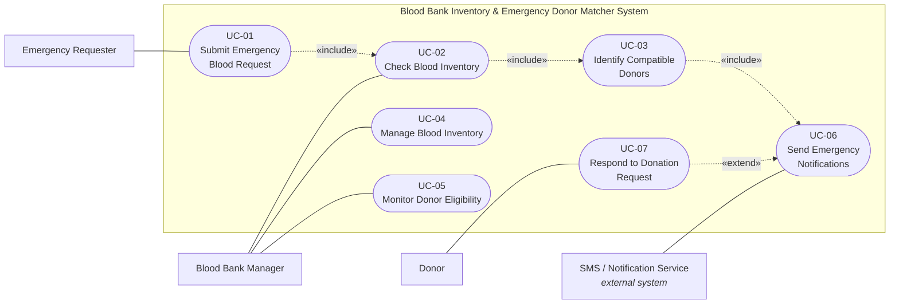

# Blood Bank Inventory & Emergency Donor Matcher

## Lab 1 — Requirements Engineering & UML Use-Case Modelling

**Problem Statement #12 — Healthcare & Telemedicine**

---

# 1. Step 1 - Problem Analysis

## 1.1 System Identified

**System:** Blood Bank Inventory & Emergency Donor Matcher

The system is intended to support real-time blood bank inventory management and emergency donor matching during critical blood shortages.

## 1.2 Actors Identified

| Actor | Interaction with the System |
|---|---|
| Emergency Requester | Raises an emergency blood request |
| Blood Bank Manager | Manages and monitors blood inventory |
| Donor | Receives/responds to emergency donation requests |
| SMS/Notification Service | Sends emergency SMS alerts |

## 1.3 Main System Functions Identified

1. Submit an emergency blood request
2. Check real-time blood inventory
3. Match the requested blood type
4. Monitor blood-unit shelf life
5. Allocate blood units
6. Identify compatible donors
7. Check donor eligibility
8. Determine donor distance/radius
9. Send emergency notifications
10. Prevent duplicate allocation of a blood bag

## 1.4 Given Requirements

### FR-001

**Description:** The system shall cross-reference emergency blood unit requests against real-time blood bank inventory and broadcast SMS alerts to compatible donors within a 10 km radius.

**Priority:** High

**Acceptance Criteria:**
- **Pass:** Compatible donors are notified within 30 seconds of the emergency flag.
- **Fail:** An incompatible blood group is alerted.

### NFR-001

**Description:** The inventory ledger must maintain strict transactional consistency, preventing simultaneous allocation of the same blood bag.

**Type:** Performance & Security

**Acceptance Criteria:** Benchmarking tests should confirm the required latency and security behavior under simulated peak load.

## 1.5 Step 1 Outcome

Step 1 establishes the system scope, actors, major functions, given requirements, and structure for the requirements-engineering phase.

---

# 2. Requirements Table

The final Requirements Table contains exactly five Functional Requirements and two Non-Functional Requirements.

| Req ID | Type | Description | Priority | Acceptance Criteria | Rationale |
|---|---|---|---|---|---|
| **FR-001** | Functional | The system shall cross-reference emergency blood unit requests against real-time blood bank inventory and broadcast SMS alerts to compatible donors within a 10 km radius. | High | **Pass:** Compatible donors are notified within 30 seconds of the emergency flag. **Fail:** An incompatible blood group is alerted. | Ensures timely notification of eligible donors and prevents alerts to incompatible donors during critical shortages. |
| **FR-002** | Functional | The system shall provide real-time monitoring of blood inventory, including blood group, component type, quantity, and expiry date. | High | **Pass:** Inventory data is updated in real time and available to users within 5 seconds of any change. **Fail:** Inventory shows outdated or incorrect quantity/expiry information. | Accurate, up-to-date inventory visibility is critical for safe issue of blood and to avoid stock-outs. |
| **FR-003** | Functional | The system shall automatically identify compatible donors based on blood group compatibility, donor eligibility, and proximity within a 10 km radius. | High | **Pass:** Only eligible, compatible donors within 10 km are returned in the match list. **Fail:** Ineligible or distant (>10 km) donors are shown in the match list. | Matches the right donors quickly to improve response time in emergencies. |
| **FR-004** | Functional | The system shall allow blood bank staff to record and update donor eligibility status based on donation history and medical criteria. | Medium | **Pass:** Eligibility status is updated and reflected across donor matching within 5 seconds. **Fail:** Donors with expired/ineligible status remain available for matching. | Ensures only safe and eligible donors are contacted for emergencies. |
| **FR-005** | Functional | The system shall maintain and update shelf-life information for all blood components and trigger alerts for units nearing expiry. | Medium | **Pass:** Expiry alerts are generated for units within 24 hours to expiry. **Fail:** Expired units are available for issue or no alert is generated. | Minimizes wastage and prevents issue of expired blood components. |
| **NFR-001** | Nonfunctional (Performance & Security) | The inventory ledger must maintain strict transactional consistency, preventing simultaneous allocation of the same blood bag. | High | **Pass:** Benchmarking tests confirm no duplicate allocation under peak load (1000 concurrent requests). **Fail:** The same blood bag is allocated concurrently to multiple requests. | Protects patient safety and maintains trust in the system. |
| **NFR-002** | Nonfunctional (Availability) | The system shall maintain at least 99.5% uptime, measured monthly. | Medium | **Pass:** Monthly uptime logs show ≥ 99.5% availability. **Fail:** Monthly uptime falls below 99.5%. | High availability is essential for life-critical emergency operations. |

## Requirements Summary

| Category | Count |
|---|---:|
| Functional Requirements | 5 |
| Non-Functional Requirements | 2 |
| **Total Requirements** | **7** |

---

# 3. UML Use-Case Diagram

## 3.1 Actors

1. **Emergency Requester**
2. **Blood Bank Manager**
3. **Donor**
4. **SMS / Notification Service** — external system

## 3.2 Use Cases

| Use Case ID | Use Case |
|---|---|
| **UC-01** | Submit Emergency Blood Request |
| **UC-02** | Check Blood Inventory |
| **UC-03** | Identify Compatible Donors |
| **UC-04** | Manage Blood Inventory |
| **UC-05** | Monitor Donor Eligibility |
| **UC-06** | Send Emergency Notifications |
| **UC-07** | Respond to Donation Request |

## 3.3 Actor Associations

| Actor | Associated Use Cases |
|---|---|
| **Emergency Requester** | UC-01 — Submit Emergency Blood Request |
| **Blood Bank Manager** | UC-02 — Check Blood Inventory; UC-04 — Manage Blood Inventory; UC-05 — Monitor Donor Eligibility |
| **Donor** | UC-07 — Respond to Donation Request |
| **SMS / Notification Service** | UC-06 — Send Emergency Notifications |

## 3.4 UML Relationships

- **UC-01 → UC-02:** `«include»`
- **UC-02 → UC-03:** `«include»`
- **UC-03 → UC-06:** `«include»`
- **UC-07 → UC-06:** `«extend»`

## 3.5 Mermaid Representation

## 3.6 Diagram Legend

| Symbol | Meaning |
|---|---|
| Solid line | Association |
| Dashed arrow with `«include»` | Mandatory included behavior |
| Dashed arrow with `«extend»` | Optional/conditional behavior |
| Rectangle | System boundary |
| Oval | Use case |
| Stick figure | Actor |

---

# 4. Use-Case Flow Specification

## UC-01 — Submit Emergency Blood Request

### Primary Actor

**Emergency Requester**

### Secondary Actors

- Blood Bank Manager
- SMS / Notification Service

### Includes

- **UC-02:** Check Blood Inventory
- **UC-03:** Identify Compatible Donors
- **UC-06:** Send Emergency Notifications

### Extends

- **UC-07:** Respond to Donation Request

### Trigger

An emergency blood requirement occurs.

## 4.1 Preconditions

1. The Emergency Requester is authorized to raise emergency blood requests.
2. The emergency blood group is known.
3. The required blood component type is known.
4. The required quantity is known.
5. The emergency location is available.

## 4.2 Postconditions — Success

1. The emergency blood request is recorded in the system.
2. The current blood inventory has been checked.
3. If available inventory is insufficient, compatible and eligible donors within a 10 km radius are identified.
4. Eligible compatible donors are notified through SMS.
5. The request status is updated to **"Notified"** when donor notification is required.

## 4.3 Main Success Scenario

1. Emergency Requester selects **"Submit Emergency Blood Request"**.
2. The system captures blood group, component type, required quantity, and emergency location.
3. The system validates the emergency request details.
4. The system uses **UC-02 — Check Blood Inventory** to retrieve current inventory.
5. If inventory is insufficient, the system uses **UC-03 — Identify Compatible Donors**.
6. UC-03 identifies donors using blood-group compatibility, donor eligibility, location/proximity, and the 10 km maximum radius.
7. The system uses **UC-06 — Send Emergency Notifications** to send SMS alerts to eligible compatible donors.
8. The system records the emergency request with status **"Notified"**.
9. The system displays confirmation that the emergency request has been processed.
10. The use case ends successfully.

## 4.4 Alternate Flow — 4a. Sufficient Inventory Available

**4a1.** At Step 4, the system determines that sufficient blood inventory is available.

**4a2.** The system notifies the Blood Bank Manager to prepare the required blood units.

**4a3.** Donor matching and emergency notification are skipped because donor assistance is not required.

**4a4.** The emergency request is recorded with an appropriate preparation/fulfillment status.

**4a5.** The use case ends.

## 4.5 Alternate Flow — 5a. No Eligible Compatible Donors Found

**5a1.** The system finds no eligible compatible donors within the 10 km radius.

**5a2.** The system informs the Emergency Requester and Blood Bank Manager.

**5a3.** The emergency request remains active for further action.

**5a4.** The use case ends with the emergency request requiring further intervention.

---

# 5. Lab 1 Deliverables

## Deliverable 1 — Requirements Table

- FR-001 to FR-005
- NFR-001 to NFR-002
- Requirement IDs
- Types
- Descriptions
- Priorities
- Measurable acceptance criteria
- Rationales

## Deliverable 2 — UML Use-Case Diagram

- 4 actors
- 7 use cases
- System boundary
- Actor associations
- `«include»` relationships
- `«extend»` relationship
- External SMS/Notification Service

## Deliverable 3 — Use-Case Flow Specification

**Selected Use Case:** UC-01 — Submit Emergency Blood Request

Includes:

- Primary Actor
- Secondary Actors
- Included Use Cases
- Extended Use Case
- Trigger
- Preconditions
- Postconditions
- Main Success Scenario
- Alternate Flows

---
